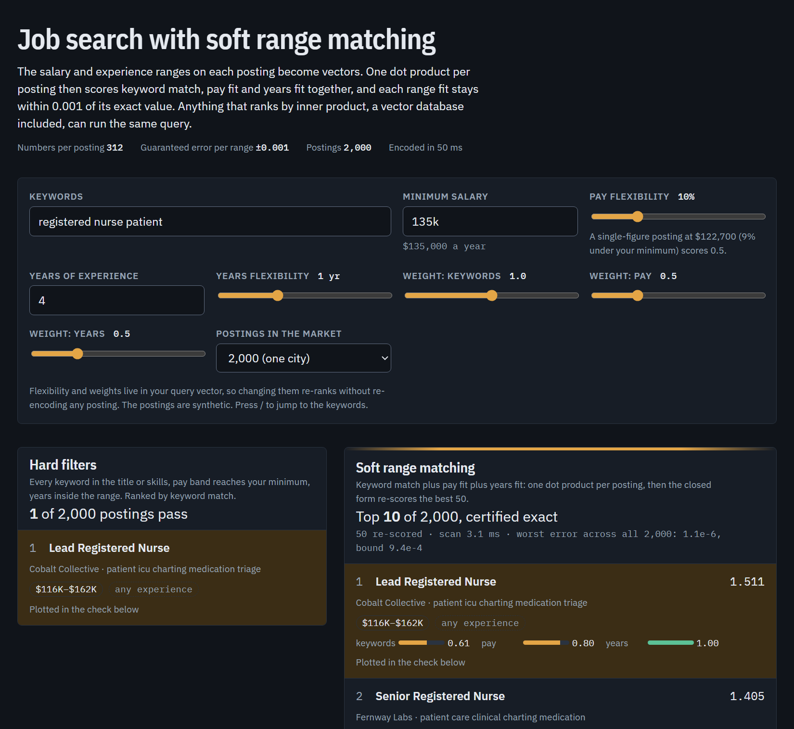

# Soft range matching with inner products

[](https://github.com/Juuzoe/ap-alg/actions/workflows/test.yml)
[](LICENSE)

A posting pays \$128k to \$138k, and a seeker wants at least \$140k but would bend by 10%. A salary filter drops the posting. The soft fit in this repository scores it 0.66 instead, and scores a \$90k to \$110k band 0.02. The fit comes out of a dot product of two fixed-length vectors, so a vector database can rank by text relevance and range fit in the same query.

The encoder turns a numeric range plus a Gaussian tolerance into a vector. The inner product of a query vector and a stored vector equals the smoothed containment score $`F`$ to within an error $`\varepsilon`$ that you pick before encoding anything:

```math
\bigl\lvert \langle u(A, s_A), v(B, s_B)\rangle - F(A, B; \sigma) \bigr\rvert \le \varepsilon,
\qquad
F(A, B; \sigma) = \frac{1}{\lvert A\rvert}\int_A \int_B \varphi_\sigma(x - y)\,dy\,dx,
\qquad
\sigma^2 = s_A^2 + s_B^2
```

$`F`$ is the expected share of range $`A`$ that lands inside range $`B`$ when Gaussian noise blurs both edges. Each side keeps its own tolerance ($`s_A`$ in the query, $`s_B`$ in the stored vector), so a seeker can loosen a search without re-encoding any posting. The write-up with proofs and experiments is [paper/soft-range-matching.md](paper/soft-range-matching.md).

## Demo

[](https://juuzoe.github.io/ap-alg/demo/)

The demo runs a job search over 2,000 or 20,000 synthetic postings and shows the hard-filter results next to the soft ranking. Pick any posting to plot its exact pay fit against the dot product and see the error at each salary. It runs at [juuzoe.github.io/ap-alg/demo](https://juuzoe.github.io/ap-alg/demo/), and `demo/index.html` also opens straight from a clone.

## Install

```bash
npm install github:Juuzoe/ap-alg
```

The library is one file with no dependencies. It runs on Node 18 or later and in the browser, where a classic `<script>` tag sets `window.softRange`. TypeScript types ship with it.

## Quick start

```js
const { axis, encode, fit } = require('ap-alg')   // or: import { axis, encode, fit } from 'ap-alg'

// Hours 0 to 24. Every pair you compare has combined slack between 0.25 h and 1 h. Error at most 0.001.
const hours = axis(24, 0.25, 1, 1e-3)

const shop = encode(hours, 9, 17, 0.3, false)        // stored: open 9:00 to 17:00, slack 0.3 h
const customer = encode(hours, 16.5, 18, 0.4, true)  // query: free 16:30 to 18:00, slack 0.4 h

const approx = customer.reduce((s, x, i) => s + x * shop[i], 0)   // 0.358275
const exact = fit(16.5, 18, 9, 17, Math.hypot(0.3, 0.4))          // 0.358275, |approx - exact| <= hours.bound
```

The `unit` flag (`true` above) marks the measured side, the range whose share inside the other one you want. A point is a range of zero width: `encode(hours, 17.25, 17.25, 0.4, true)` scores a 17:15 arrival against the same opening hours at 0.31, where a hard cutoff gives 0.

The [examples](examples) folder has three runnable scripts:

| file | what it shows |
|---|---|
| [`quickstart.js`](examples/quickstart.js) | the code above, plus a stricter query and a point |
| [`rentals.js`](examples/rentals.js) | a second domain: 5,000 flats scored on rent and floor area, and the near misses a hard filter drops |
| [`job-search.js`](examples/job-search.js) | the job-board model over 20,000 postings in a `Float32Array`, with a certified exact top 10 |

## The job-board model

`jobModel()` fixes a log salary axis from \$15k to \$600k a year and an experience axis from 0 to 30 years (paper, Section 3.6), and lays out one row per posting as `[text embedding | salary block | experience block | 2 missing-value flags]`.

```js
const { jobModel, topK } = require('ap-alg')
const M = jobModel({ textDim: 384, eps: 1e-3 })   // textDim: the length of your unit-length text embedding

// Store one row per posting. salary: [lo, hi], a single figure or null. years: [min, max], [min, null] or null.
const row = M.encodeJob({ emb, salary: [120000, 150000], salaryStretch: 0.2, years: [3, null], yearsStretch: 1 })

// Per search: a query vector and delta, the most any dot product can differ from M.exactScore().
const { q, delta } = M.encodeSeeker({ emb, minSalary: 140000, salaryFlex: 0.1, years: 4, yearsFlex: 1, wText: 1, wSalary: 0.5, wYears: 0.5 })
```

At $`\varepsilon = 10^{-3}`$ the salary block takes 133 numbers and the experience block 113. A posting with no salary scores 0.5 on pay by default (`pMissing`), and one with no years requirement scores 1. [`soft-range.d.ts`](soft-range.d.ts) documents every field.

## Using a vector database

Store the rows in any engine that ranks by raw inner product. Cosine similarity normalizes the vectors and breaks the score.

| engine | setting |
|---|---|
| pgvector | a `vector(n)` column, `ORDER BY embedding <#> $1` (`<#>` is the negative inner product) |
| FAISS | `IndexFlatIP` |
| Qdrant | `distance: Dot` |
| Milvus | `metric_type: IP` |
| Elasticsearch | `dense_vector` with `similarity: max_inner_product` (the `dot_product` option expects unit-length vectors) |
| OpenSearch | `knn_vector` with `space_type: innerproduct` |

An exact search can prove its top k. Ask for the best L + 1 hits, re-score the first L with `exactScore`, and pass the score of hit L + 1 as `unseen`:

```js
// hits: the best L + 1 results of an exact (flat) search, as [{ id, score }]
const seen = hits.slice(0, -1), unseen = hits[hits.length - 1].score
const { top, certified } = topK(seen.map(h => h.score), i => M.exactScore(seeker, postings[seen[i].id]).score, 10, delta, unseen)
// certified === false means the top 10 may continue past hit L: ask for more hits and run topK again.
```

Approximate indexes (IVF, HNSW) can skip postings, so their results carry no such proof. In our inverted-file test the fused vectors also indexed badly (below). A flat scan of 20,000 postings took 13 to 20 ms per query in plain JavaScript on one core. Past the size where a scan is affordable, shortlist by text and re-score the shortlist with the fused vector or `exactScore`.

## Results

From `bench/bench.js` and `bench/ann.js` on a seeded synthetic job market of 20,000 postings and 200 seekers, with vectors stored in float32 (paper, Section 5):

| | |
|---|---|
| vector length at $`\varepsilon = 10^{-3}`$ | 133 numbers per salary range, 113 per experience range |
| largest observed error, 4 million pairs | $`3.4\times10^{-4}`$ (pay), $`1.3\times10^{-4}`$ (years) |
| same length spent on interpolation bins | maximum error $`2.2\times10^{-2}`$ |
| same length spent on random Fourier features | maximum error 1.1 |
| flat scan, top 10 certified exact | 200 of 200 queries, after re-scoring 50 of 20,000 postings |
| text shortlist re-scored exactly, recall@10 | 0.48 at 50 candidates, 0.79 at 200, 1.00 at 1,000 |
| k-means inverted file, recall@10 at about 11% scanned | 0.76 for the fused vectors, 1.00 for text vectors with a 1,000-candidate re-score |

The last row is a limitation. The range blocks have larger norms than the text block, so the fused vectors cluster by pay and experience rather than by role, and probing the nearest clusters misses good matches. All results so far come from synthetic data.

## How it works

Put the axis on a circle of circumference $`P`$, a little longer than the data. On the circle, the Gaussian-smoothed overlap of two intervals has a Fourier series, and its $`k`$-th term splits into a factor that depends only on $`A`$ and a factor that depends only on $`B`$. The Gaussian damping $`e^{-\sigma^2\omega_k^2/2}`$ splits the same way, as $`e^{-s_A^2\omega_k^2/2}\,e^{-s_B^2\omega_k^2/2}`$, which is why each side can carry its own slack. Keeping $`K`$ harmonics gives vectors of length $`2K + 1`$. Theorem 1 in the paper bounds the three error sources (dropped harmonics, wrap-around on the circle and cut-off open ends), and `axis()` picks the smallest $`K`$ that meets $`\varepsilon`$. `topK()` uses the bound to stop re-scoring early, following the multi-step k-NN rule of Seidl and Kriegel (1998).

## Reproduce

```bash
node test.js
```

```bash
npm run bench
```

```bash
npm run examples
```

The benchmarks use fixed seeds and print the tables in the paper; only the timings change between machines. `bench/ann.js` trains two k-means quantizers and takes about 20 seconds.

## Repository layout

| path | contents |
|---|---|
| [`soft-range.js`](soft-range.js) | the library: `axis`, `encode`, `fit`, `topK` and `jobModel` |
| [`soft-range.mjs`](soft-range.mjs), [`soft-range.d.ts`](soft-range.d.ts) | ES module entry and TypeScript types |
| [`test.js`](test.js) | error bound, input handling, certified top-k |
| [`examples/`](examples) | three runnable scripts |
| [`bench/`](bench) | the synthetic market generator and the two benchmarks |
| [`paper/`](paper/soft-range-matching.md) | method, proofs, experiments, related work |
| [`demo/`](demo) | the interactive comparison; see [`demo/README.md`](demo/README.md) |

## Contributing

Issues and pull requests are welcome; [CONTRIBUTING.md](CONTRIBUTING.md) covers the workflow. Open problems where help would count most:

- an evaluation on real job postings that publish salary ranges
- an index that keeps recall on the fused vectors (the inverted file above does not)
- ports to Python or Rust that pass the same error-bound tests
- other domains with ranges, such as prices, dates, sizes or time windows

## Citing

GitHub's "Cite this repository" button reads [CITATION.cff](CITATION.cff). In BibTeX:

```bibtex
@software{soft_range_matching_2026,
  author  = {Juuzoe},
  title   = {Soft Range Matching as an Inner Product with a Deterministic Error Bound},
  year    = {2026},
  version = {0.1.0},
  url     = {https://github.com/Juuzoe/ap-alg}
}
```

## License

Apache License 2.0, see [LICENSE](LICENSE). The license includes a patent grant from every contributor, which ends for anyone who sues claiming the work infringes a patent.
